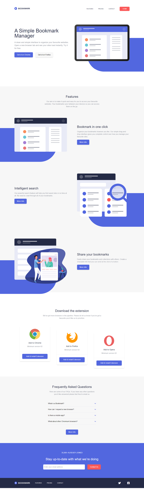

# Creating a landing page for a bookmark manager extension

## Tools

- html
- TailwindCSS

## Author

Rafaelly Rodrigues

- @moonrafa

## Demonstration

<table>
<tr>
<td>
desktop
</td>
<td>
mobile
</td>
</tr>
<tr>
<td>

</td>
<td>

</td>
</tr>
</table>
